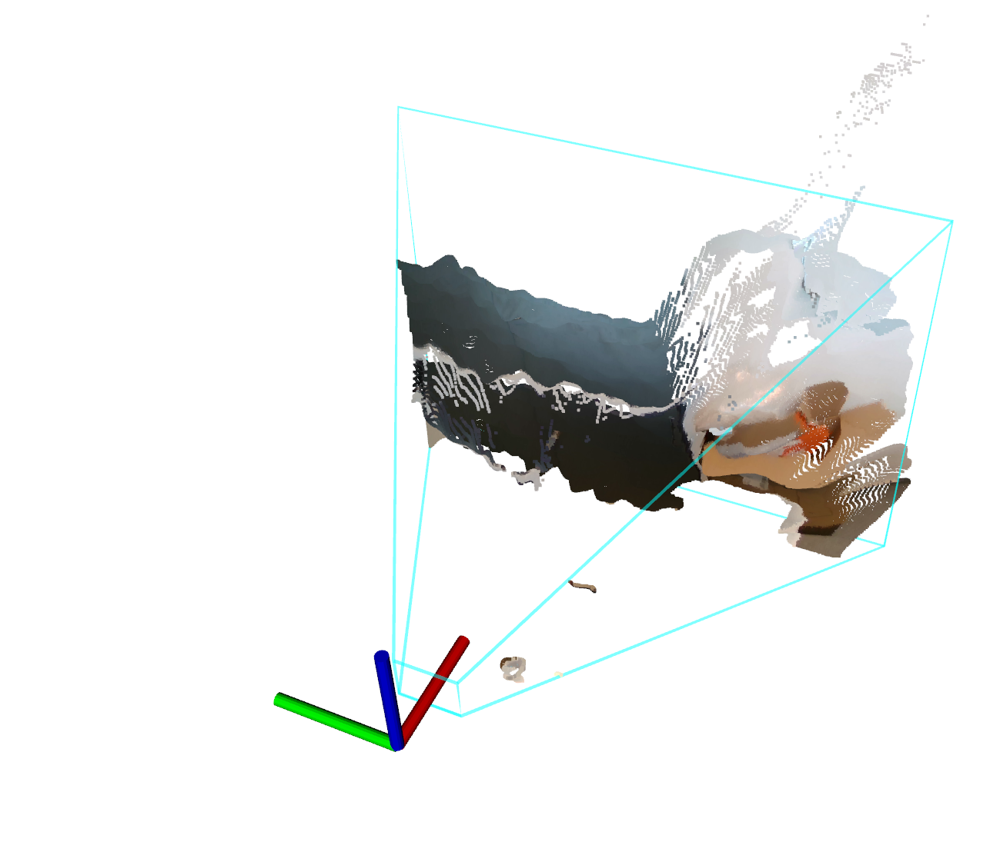

# ipa_3d_fov_visualization
This package visualizes the field of view (FOV) form stereo cameras using the pinhole model

## Requirements:
1. System with Ubuntu14.04+ and ROS http://wiki.ros.org
1. Stereo Camera (testet with Intel RealSense D435)

## Usage:

1. Adapt ROS-Topics of the Camera Info. in launch-File. e.g. <remap from="camera_info" to="camera/color/camera_info"/>

## Options:

